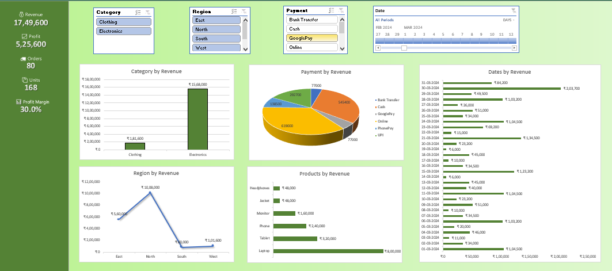

# Business Data Analytics (Beginner)
### Dashboard Visuals
1.Interactive_Sales_Dashboard.
|

2.Little_Twins_Dashboard.
|

3.Practice_Dashboard

{
This project is an interactive dashboard built in Excel.
## 🔹 Features
- KPI Metrics (Revenue, Profit, Orders)
- Pivot Charts
- Slicers & Timeline
- Dynamic Filtering

## 🔹 Tools Used
- Microsoft Excel
}
|

Hi, I'm Shahnawaz Khan 👋  
Master’s student in Digital Technologies & Management (Germany)

## About this repository
This repository documents my learning journey in Business & Data Analytics.

## Currently learning
- Excel fundamentals for business analysis
- Data cleaning basics
- Understanding KPIs and business metrics

## Goal
To become job-ready for Werkstudent roles in Business/Data Analytics.

## Status
 Beginner – learning step by step with hands-on practice

